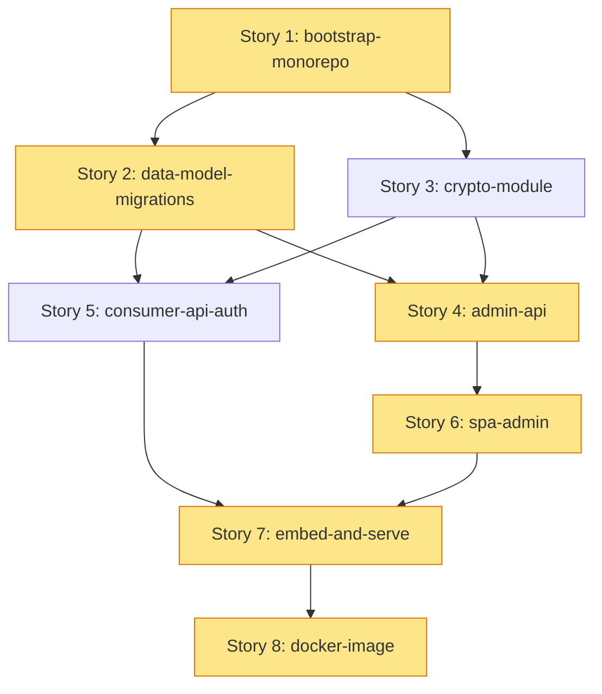

# Epic: Resource Tenant Service — monorepo Go + SPA, com Docker validado

**Origin:** `planning/resource-tenant-service/intake.md`

## Traceability
- Prototype routes/screens: `planning/resource-tenant-service/proto/` — `/`, `/tenants`, `/tenants/:id`, `/resource-definitions`, `/resource-definitions/:id`, `/api-clients`
- Business rules: wiki ai-memory `centralit/resource-tenant` → `business/rules.md` (RN-01..RN-09)
- Source docs (wiki): `architecture/why-this-service`, `architecture/overview`, `architecture/data-model`, `decisions/decision-log` (#1..#14), `prototype/admin-console`

## Context
- **Macro problem:** A plataforma precisa de multi-tenancy de infraestrutura — cada tenant tem banco, bucket e configs próprios. Falta um dono leve e autônomo desse conhecimento, consultável por hostname no hot path.
- **Initiative objective:** Entregar o `resource-tenant` como serviço autônomo: server Go + SPA admin no mesmo binário, criptografia moderna de secrets, API de consumo (resolve por hostname) e API admin, empacotado em imagem Docker validada.
- **Expected outcome:** Binário único deployável só com PostgreSQL; resolução determinística `hostname → config do tenant`; secrets AES-256-GCM; painel admin para cadastro/gestão.
- **Constraints/premises:** Stack fixada (decisões #6/#7/#13): Go + chi + pgx + sqlc + goose; SPA React + shadcn + **TanStack Router**; SPA embutido via `embed.FS`; só Postgres como dependência de runtime; TDD no desenvolvimento.

### AS-IS
- Conhecimento "tenant → recursos" vive acoplado a um monólito (Spring) com Kafka/MinIO; não há serviço leve dedicado.
- Existe apenas o protótipo de UI (Preact/htm) validando os fluxos; nenhum código de produção.

### TO-BE
- Monorepo com `server/` (Go) e `web/` (SPA React+shadcn+TanStack Router), build do SPA embarcado no binário Go.
- API de consumo: `GET /v1/resolve?hostname=` e `GET /v1/resolve/{host}/resources/{definitionKey}`.
- API admin: CRUD de tenants, domains, resource-definitions (+fields), tenant-resources (+values), api-clients.
- Secrets cifrados em repouso (AES-256-GCM, chave externalizada), decrypt server-side no consumo, mascarados no admin.
- Imagem Docker multi-stage construída e validada (sobe, responde health + resolve).

### Out of scope
- Kafka / mensageria e cache em object storage (decisão #3).
- Cofre de segredos externo (chave AES via env/config por ora).
- Versionamento de definitions (decisão #14).
- RBAC / multi-usuário no painel (auth de painel mínima; foco é a API key server-to-server).

## Story backlog

### Story 1: bootstrap-monorepo
**Size:** medium | **Status:** [x] Done | **Depends on:** --
**Objective:** Estrutura do monorepo (`server/` Go + `web/` SPA), toolchain, lint/test, Makefile/Taskfile, CI mínimo local; "hello" do server + SPA buildando.
**Traceability:** Prototype: todas as rotas (alvo do `web/`); Rules: —
**Acceptance criteria:**
- [x] `server/` compila (`go build`) e roda um health endpoint `GET /healthz`.
- [x] `web/` (Vite + React + shadcn + TanStack Router) builda (`bun run build`) gerando `dist/`.
- [x] Comando único de build/test documentado (Makefile/Taskfile).
- [x] Teste de fumaça do health passando (TDD: teste antes).

### Story 2: data-model-migrations
**Size:** medium | **Status:** [x] Done | **Depends on:** Story 1
**Objective:** Schema PostgreSQL via goose + queries sqlc para todas as tabelas do modelo.
**Traceability:** Rules: RN-01, RN-07, RN-08, RN-09; docs: `architecture/data-model`
**Acceptance criteria:**
- [x] Migrations goose criam `tenants, tenant_domains, resource_definitions, resource_fields, tenant_resources, tenant_resource_values, api_clients`.
- [x] Índice único parcial `(tenant_id, resource_definition_id) WHERE status='active'` (RN-01).
- [x] `tenant_domains.hostname` unique; `resource_definitions.key` unique; `resource_fields (definition_id,key)` unique.
- [x] sqlc gera código type-safe; testes de repositório com Postgres (testcontainers/dockertest) verdes.

### Story 3: crypto-module
**Size:** small | **Status:** [x] Done | **Depends on:** Story 1
**Objective:** Módulo de criptografia AES-256-GCM com chave externalizada e `key_version`.
**Traceability:** Rules: RN-04, RN-05; docs: decisão #4/#5
**Acceptance criteria:**
- [x] `Encrypt(plaintext) -> (cipher, nonce, key_version)` e `Decrypt(...)` round-trip.
- [x] Chave lida de env/config; falha clara se ausente/!=32 bytes.
- [x] Nonce aleatório por operação; testes de round-trip e de adulteração (GCM detecta).

### Story 4: admin-api
**Size:** large | **Status:** [x] Done | **Depends on:** Story 2, Story 3
**Objective:** API REST admin: CRUD de tenants, domains, resource-definitions (+fields), tenant-resources (+values), api-clients; validação contra a definition; mascaramento de secrets.
**Traceability:** Rules: RN-01, RN-03, RN-04, RN-06, RN-07, RN-08, RN-09; proto: `/tenants*`, `/resource-definitions*`, `/api-clients`
**Acceptance criteria:**
- [x] CRUD completo nas entidades acima (chi handlers + serviços).
- [x] Create/update de tenant-resource valida required + dispara cripto em `is_secret` (RN-03/RN-04).
- [x] Unicidade 1-ativo-por-(tenant,definition) imposta (RN-01) com erro de negócio claro.
- [x] Secrets retornam mascarados; `?reveal=true` revela (RN-06).
- [x] Testes de handler/serviço (TDD) cobrindo casos felizes e regras.

### Story 5: consumer-api-auth
**Size:** medium | **Status:** [x] Done | **Depends on:** Story 2, Story 3
**Objective:** API de consumo (resolve por hostname) com decrypt server-side + autenticação por API key.
**Traceability:** Rules: RN-02, RN-05, RN-09; docs: decisão #5/#8/#9
**Acceptance criteria:**
- [x] `GET /v1/resolve?hostname=` → tenant + recursos ativos (valores secret em claro).
- [x] `GET /v1/resolve/{host}/resources/{definitionKey}` → recurso específico.
- [x] Middleware de API key (hash em `api_clients`); 401 sem/!=token; revogado bloqueia.
- [x] Resolução por match exato de hostname (RN-02); testes de auth + resolução.

### Story 6: spa-admin
**Size:** large | **Status:** [x] Done | **Depends on:** Story 4
**Objective:** SPA admin real (React + shadcn + TanStack Router) consumindo a admin-api, portando os fluxos do protótipo.
**Traceability:** proto: todas as rotas; Rules: RN-01, RN-03, RN-06
**Acceptance criteria:**
- [x] Rotas TanStack Router equivalentes às do protótipo.
- [x] Telas: visão geral, tenants (lista/detalhe com recursos+domains), resource-definitions (lista/detalhe com IconPicker), api-clients.
- [x] Secrets mascarados com revelar; criação de recurso com campos dinâmicos da definition.
- [x] Build do SPA consumido pelo Go via embed (integra com Story 7).

### Story 7: embed-and-serve
**Size:** small | **Status:** [x] Done | **Depends on:** Story 5, Story 6
**Objective:** Servir o SPA pelo binário Go (embed.FS) no mesmo origin da API, com fallback de rota para `index.html`.
**Traceability:** docs: decisão #13
**Acceptance criteria:**
- [x] `go build` embute `web/dist`; `/` serve o SPA; `/v1/*` serve a API; sem CORS.
- [x] Fallback SPA (rotas client-side resolvem para index.html).
- [x] Teste de integração: binário sobe, serve `index.html` e responde `/v1/resolve`.

### Story 8: docker-image
**Size:** medium | **Status:** [x] Done | **Depends on:** Story 7
**Objective:** Dockerfile multi-stage (build web + build Go → imagem mínima) e validação ponta-a-ponta com Postgres.
**Traceability:** docs: `architecture/why-this-service` (leveza/deploy)
**Acceptance criteria:**
- [x] Multi-stage: estágio web (bun build), estágio Go (build estático), runtime mínimo (distroless/scratch).
- [x] `docker compose` sobe app + postgres; migrations aplicam; health ok.
- [x] Validação E2E: criar tenant+recurso via admin e resolver por hostname dentro do container.
- [x] Imagem documentada (tamanho, variáveis de ambiente: DSN, AES key, API).

## Epic roadmap

- **Caminho crítico (amarelo):** S1 → S2 → S4 → S6 → S7 → S8.
- **Paralelizável:** S3 (crypto) junto de S2; S5 (consumer-api) junto de S4 após S2+S3.
- **Milestones:** após S2 (persistência verificável), após S5 (API consumível end-to-end), após S7 (binário único servindo tudo), após S8 (imagem validada = objetivo do épico).

## Epic acceptance criteria
- [x] Monorepo com `server/` (Go) e `web/` (React+shadcn+TanStack Router) buildando por comando único.
- [x] Migrations + sqlc cobrindo todo o modelo, com a invariante RN-01 imposta no banco.
- [x] Secrets cifrados AES-256-GCM em repouso; decrypt server-side só no consumo; mascarados no admin.
- [x] API de consumo resolve por hostname com auth por API key; API admin cobre todo o CRUD com validação.
- [x] SPA admin real serve os fluxos do protótipo, embutido no binário Go (sem CORS).
- [x] Imagem Docker multi-stage construída e **validada E2E** (sobe com Postgres, cria e resolve um tenant).
- [x] Desenvolvimento conduzido por TDD (testes antes da implementação em cada story).

## Risks

| Risk | Mitigation |
|---|---|
| Embed do SPA + roteamento client-side conflitar com rotas da API | Prefixo `/v1` para API; fallback para index.html só fora de `/v1`; teste de integração na S7 |
| sqlc/goose + testes exigindo Postgres real complicarem CI local | Usar testcontainers/dockertest; documentar `make test` que sobe Postgres efêmero |
| Gestão da chave AES (perda = dados irrecuperáveis) | Chave via env obrigatória; `key_version` no schema p/ rotação futura; validação de tamanho no boot |
| TanStack Router + shadcn setup novo divergir do protótipo | Portar rota a rota a partir do protótipo já validado; reaproveitar componentes shadcn |
| Imagem inchada (objetivo é leveza) | Multi-stage + runtime distroless/scratch; medir e registrar tamanho na S8 |

## Recommended next step
- `/agile-story` para criar o plano de execução da **Story 1 (bootstrap-monorepo)** — primeira por dependência.

<!-- Save as: planning/resource-tenant-service/epics/01-resource-tenant-service/00-overview.md -->
