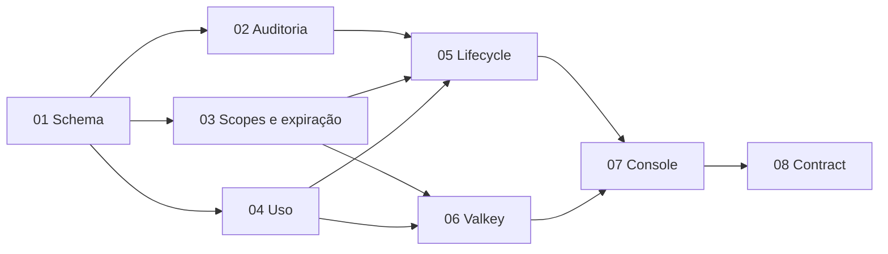

# Epic 02 — Governança operacional

**Origin:** `planning/tenancit/intake.md`

## Contexto

O Tenancit possui API clients hash-only e revogáveis, mas ainda não oferece
menor privilégio, expiração, limite global, telemetria ou auditoria
administrativa. O objetivo é entregar essas capacidades com rollout
expand/contract, preservando clients existentes e usando o reference implementation apenas
como referência comparativa.

Ficam fora: scopes do reference implementation, `X-API-Key`, limiter local em produção,
defaults permissivos e auditoria best-effort.

## Rastreabilidade

- Designs: `docs/developers/design/api-client-policy.md` e
  `docs/developers/design/admin-audit-log.md`.
- ADRs: 0004 e 0005.
- Superfícies: `/api-clients`, futuro `/usage` e `/audit-events`.
- Catálogo: `e2e/flows` e personas administrativas/de integração.

## Backlog

| # | História | Tamanho | Dependências | Estado |
|---|---|---|---|---|
| 01 | Schema expandível e contratos | L | — | em andamento |
| 02 | Auditoria transacional | L | 01 | pendente |
| 03 | Scopes e expiração | L | 01 | pendente |
| 04 | Telemetria de uso | L | 01 | pendente |
| 05 | Lifecycle seguro | L | 02, 03, 04 | pendente |
| 06 | Limite global com Valkey | L | 03, 04 | pendente |
| 07 | Console e UX por persona | L | 05, 06 | pendente |
| 08 | Retirada do legado | M | 07 | pendente |

## Roadmap

## Critérios de aceite do epic

- Clients legados atravessam o expand sem interrupção e são retirados por
  inventário, nunca por expiração retroativa.
- Scopes, expiração, revogação e rate limit são síncronos; uso é agregado.
- Toda mutação admin e reveal sensível possui auditoria sem secrets.
- Limite é global entre réplicas via Valkey e falha fechado.
- Console e catálogo E2E cobrem lifecycle, uso, auditoria e personas.
- Contract só ocorre quando `legacy_unbounded = 0`.

## Riscos

- Migração incompatível: mitigar com campos nullable e deploy expand/contract.
- Vazamento em telemetria: mitigar com allowlists e canários reconhecíveis.
- Limiter divergente: provar atomicidade em duas instâncias e sem fallback.
- Auditoria incompleta: mutações de sucesso e reveal falham se o evento não
  puder ser persistido.
