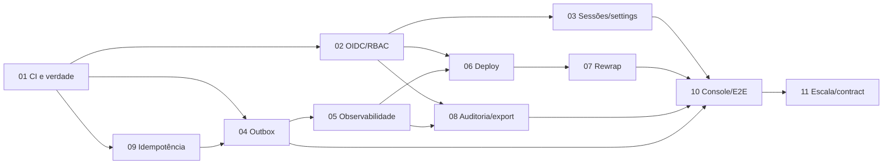

# Epic 03 — Plataforma operacional, identidade e entrega confiável

**Origin:** `planning/tenancit/intake.md`

## Contexto

O epic 02 entregou governança de API clients, auditoria, uso, Valkey e console,
mas a verdade documental ficou defasada e a CI remota não sustenta o conjunto
de integração. O próximo salto transforma a fundação técnica em uma plataforma
operável por pessoas identificáveis, implantável em múltiplas réplicas e capaz
de notificar consumidores com garantias transacionais.

AS-IS: token administrativo compartilhado, CI instável por Testcontainers,
deploy sem alvo comprovado, rewrap apenas desenhado e ausência de outbox,
idempotência e observabilidade de aplicação.

TO-BE: OIDC/sessões/CSRF/RBAC, break-glass explícito, CI determinística,
outbox/webhooks, métricas/traces, rewrap executável, operação e restore
verificados, console por persona e documentação sincronizada com o produto.

Ficam fora do compromisso incondicional: escolha do IdP e do ambiente de
produção pelo operador, credenciais reais, SIEM/WORM específico e paginação
server-side sem evidência de volume.

## Rastreabilidade

- Pesquisa: `planning/tenancit/research/reference implementation-delta-2026-07-11.md`.
- ADRs: 0003, 0004, 0005 e 0006.
- Designs: auditoria, política de API clients e rewrap AES.
- Superfícies: todas as rotas admin, `/audit-events`, `/usage` e novas telas de
  sessões, integrações, operação e configurações.
- Catálogo: `e2e/flows`, `e2e/personas` e scoreboard operacional.

## Backlog

| # | História | Objetivo observável | Tam. | Dependências | Estado |
|---|---|---|---|---|---|
| 01 | CI verde e verdade reconciliada | Pipeline confiável e docs compatíveis com `main` | M | — | entregue; 3 runs verdes |
| 02 | Sessões OIDC, CSRF e RBAC | Operador humano entra, age e encerra sessão individual | XL | 01 | entregue; ativação real depende do IdP |
| 03 | Governança de sessões e settings | Administrador revoga sessões e altera políticas runtime seguras | L | 02 | entregue |
| 04 | Outbox, webhooks e change feed | Consumidor recebe mudanças assinadas com retry/DLQ | XL | 01 | entregue |
| 05 | Observabilidade e saúde operacional | Operador diagnostica dependências, jobs e SLOs sem secrets | L | 01, 04 | entregue |
| 06 | Deploy, DB roles e continuidade | Ambiente alvo passa preflight, rollout, restore e rollback | XL | 02, 05 | entregue localmente; alvo real pendente |
| 07 | Rewrap AES executável | Operador recriptografa em lotes com dry-run e retomada | L | 01, 05, 06 | pendente |
| 08 | Auditoria, retenção e exportação | Auditor consulta/exporta trilha íntegra e limitada | L | 02, 05 | pendente |
| 09 | Idempotência administrativa | Retry de mutação não duplica efeitos nem sucessores | L | 01, 04 | pendente |
| 10 | Console por persona e catálogo E2E | UI cobre identidade, segurança e operação em 3 idiomas | XL | 03–09 | pendente |
| 11 | Gate de escala e contract final | Decisão de paginação baseada em evidência e docs encerradas | M | 10 | pendente |

## Roadmap

Caminho crítico: 01 → 02 → 06 → 07 → 10 → 11. Outbox/idempotência e
auditoria podem avançar em paralelo depois que a CI estiver confiável.

## Gates externos

- IdP de produção: issuer, client, audience, claims/grupos e owners.
- Ambiente alvo: domínio, ingress/TLS, secret manager, réplicas e trusted proxies.
- Política organizacional: retenção, destino de exportação e SLO/RPO/RTO.

Ausência dessas decisões não bloqueia contratos, fixtures locais, testes e
automação genérica; bloqueia somente declarar produção ativada/provada.

## Critérios de aceite do epic

- Branch principal e pipeline programado ficam verdes em três execuções sem retry.
- Nenhum token admin permanece no browser; sessões são hash-only, expiráveis,
  revogáveis e protegidas por CSRF/origin.
- Toda rota declara permissão e toda ação humana auditada usa `iss` + `sub`.
- Outbox é transacional; entrega é idempotente, assinada, observável e não vaza secrets.
- Métricas, traces e logs possuem canários negativos para tokens e payloads.
- Rewrap passa dry-run, interrupção/retomada, concorrência e restore representativo.
- Deploy multi-réplica prova migrations, limiter, revogação, backup e rollback.
- Console e catálogo E2E cobrem admin, operador, auditor e integrador em pt/en/es.
- Paginação é implementada somente se o gate documentado recomendar `MIGRATE`.
- Handoff, roadmap, ADRs, contratos e runbooks descrevem o estado efetivamente entregue.

## Riscos

- IdP indisponível: break-glass explícito, limitado e auditado; nunca fallback automático.
- CSRF regressivo: matriz por método/origin e reveal convertido em ação não-GET.
- Duplicidade de eventos: chave idempotente + outbox única + inbox por destino.
- Webhook lento: worker separado, timeout, retry com jitter e DLQ.
- Migração incompatível: expand/contract e binário anterior testado.
- Cardinalidade operacional: retenção/particionamento e paginação condicionada.
- Escopo prolongado: cada história entrega um fluxo vertical e atualiza este status.
