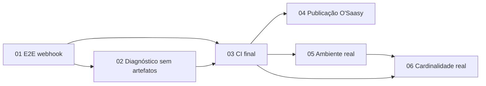

# Epic 04 — Publicação e validação em ambiente real

**Origin:** `planning/tenancit/intake.md`

## Contexto

O Tenancit encerrou a implementação genérica dos epics 01–03 e está pronto para
ser preparado como projeto público. Restam, porém, uma regressão E2E específica,
um erro secundário causado pela cota de artefatos do GitHub, a confirmação remota
do pipeline e validações que somente um ambiente real pode fornecer.

AS-IS: servidor, SPA e produto empacotado passam na CI; 21/22 testes Playwright
passam, mas o fluxo de webhook não encontra o segredo one-shot após salvar. O
upload de artefatos na falha também excede a cota. O repositório continua privado,
e IdP, topologia, políticas operacionais e cardinalidade reais ainda não existem.

TO-BE: `main` integralmente verde, diagnóstico E2E independente da cota, pacote
de publicação coerente com O'Saasy, configurações públicas seguras e um roteiro
executável para validar produção e decidir paginação com evidência.

### Decisões e limites

- A licença escolhida é O'Saasy. A verificação desta iniciativa é interna:
  consistência entre `LICENSE`, README, contribuições, distribuição e metadados.
  Não há revisão jurídica externa nem decisão pendente do mantenedor.
- Tornar o repositório público é uma mudança externa e irreversível em termos de
  exposição. A história prepara e verifica tudo, mas somente altera a visibilidade
  após autorização explícita no momento da execução.
- IdP, domínio, ingress, TLS, secret manager, trusted proxies, retenção, SLO,
  RPO e RTO dependem do ambiente escolhido. A ausência desses dados não bloqueia
  a preparação; bloqueia apenas declarar produção validada.
- Paginação server-side continua condicionada à cardinalidade real ou prevista.
  O primeiro gatilho observado é 500 definições; sem evidência, mantém-se
  `KEEP_FULL_LISTS`.

## Rastreabilidade

- Estado executável: `docs/HANDOFF.md`.
- Roadmap: `docs/business/04-escopo-e-roadmap.adoc`.
- Licenciamento: `LICENSE`, `docs/business/05-licenciamento-e-sustentabilidade.adoc`.
- Segurança pública: `SECURITY.md`, `.github/workflows/security.yml`.
- Operação: `docs/runbooks/container-deploy.md`,
  `docs/runbooks/aes-key-rewrap.md` e `docs/runbooks/post-deploy-smoke.md`.
- Escala: `planning/tenancit/roadmap-quality-scale.md`.
- UI/protótipos: não há nova superfície obrigatória; este epic valida o produto
  já entregue.

## Backlog

| # | História | Objetivo observável | Tam. | Dependências | Estado |
|---|---|---|---|---|---|
| 01 | Estabilizar o E2E de webhook | Fluxo assinado passa de forma determinística e preserva one-shot secret | M | — | DONE — 3 isoladas + catálogo completo |
| 02 | Diagnóstico sem depender de artefatos | Falhas E2E continuam investigáveis mesmo com cota esgotada | S | 01 parcial | DONE — workflow remoto validado |
| 03 | Confirmar a CI final | `main` passa integralmente em execuções remotas limpas | S | 01, 02 | DONE — 3/3 runs verdes |
| 04 | Preparar a publicação O'Saasy | Repositório pode ser tornado público sem inconsistências de licença, segurança ou metadados | M | 03 | IN PROGRESS — advisories em remediação |
| 05 | Validar o primeiro ambiente real | IdP, topologia, continuidade, limiter e rewrap possuem evidência sanitizada | XL | 03; ambiente alvo | TODO — gate externo |
| 06 | Reavaliar escala com cardinalidade real | Decisão `KEEP_FULL_LISTS` ou `MIGRATE` é reproduzível e baseada em volume real | M | telemetria/estimativa real | IN PROGRESS — harness verde; volume pendente |

## Roadmap

Caminho crítico para publicação: 01 → 02 → 03 → 04. A coleta de volume pode
começar após a CI, mas a decisão final deve usar dados do ambiente real ou uma
projeção formalmente registrada.

### Checkpoints de retomada entre sessões

Ao concluir ou pausar uma história:

1. atualizar seu `Estado`, checklists e seção `Evidência`;
2. atualizar a tabela deste overview e `docs/HANDOFF.md`;
3. registrar comandos, IDs/URLs de runs e decisões sem secrets;
4. deixar explícito o próximo item executável e qualquer gate externo;
5. não marcar história como entregue com base apenas em implementação local
   quando seu aceite exige GitHub ou ambiente real.

## Critérios de aceite do epic

- E2E de webhook passa repetidamente sem retry encobrir defeito.
- Falha Playwright produz diagnóstico útil localmente e na saída do job mesmo
  quando upload de artefatos estiver indisponível.
- Todos os jobs obrigatórios de `main` ficam verdes em execuções remotas limpas.
- Licença O'Saasy e documentos públicos são coerentes e nenhum segredo ou
  referência privada reaparece no histórico/working tree.
- Publicação, se autorizada, ativa regras de branch e recursos de segurança
  aplicáveis a repositório público.
- O primeiro ambiente real passa preflight, smoke, continuidade, backup/restore,
  limiter multi-réplica, OIDC e ensaio de rewrap, com evidência sanitizada.
- O gate de escala registra volume observado/projetado e mantém listas ou abre
  um epic separado de paginação server-side conforme os thresholds existentes.

## Riscos

- E2E mascarar regressão como timing: investigar contrato e estado one-shot
  antes de aumentar timeout ou retry.
- Perda de diagnóstico por cota: imprimir resumo sanitizado no job e tratar
  upload como complemento não bloqueante.
- Exposição prematura: executar novo scan de histórico imediatamente antes da
  mudança de visibilidade e exigir autorização explícita.
- Configuração real vazar secrets: evidências usam IDs, checksums e estados,
  nunca tokens, cookies, DSNs ou payloads.
- Ambiente único produzir falsa confiança: validar duas réplicas e falhas
  controladas antes de declarar continuidade.
- Paginação prematura: não alterar contratos sem observar/projetar o gatilho.
