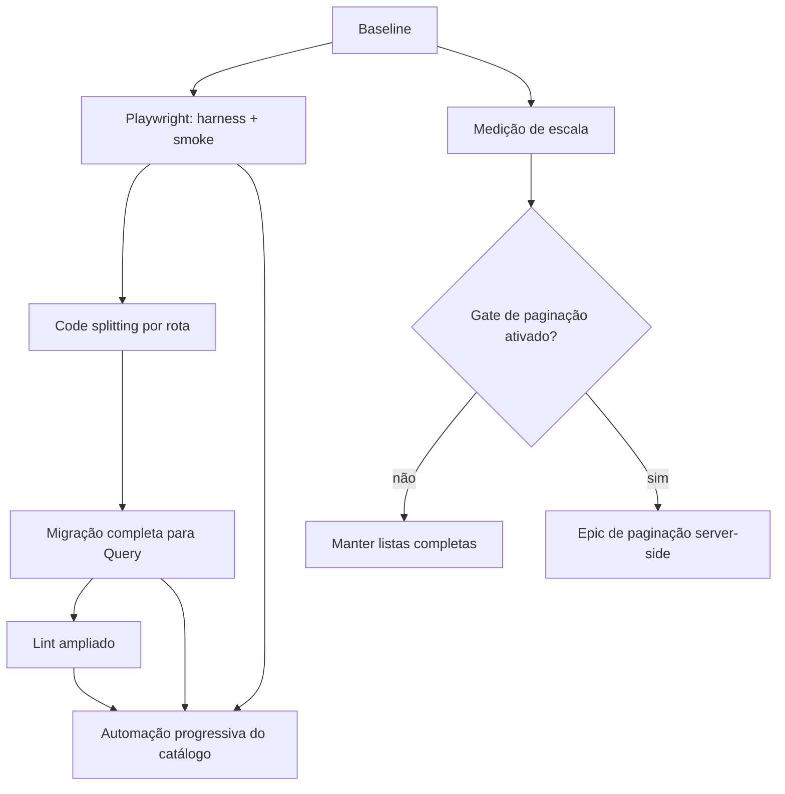

# Roadmap: qualidade, carregamento e escala do console

**Origem:** `docs/HANDOFF.md`, `docs/business/04-escopo-e-roadmap.adoc` e análise
comparativa com `<reference-project>`
**Tipo:** trajetória
**Estado:** concluído até a Fase 6 em 2026-07-10

## Contexto

- **Objetivo:** tornar o console previsível para evoluir identidade, auditoria e
  governança sem carregar dívida de estado, bundle, lint ou testes end-to-end.
- **Horizonte:** execução por fases, sem compromisso de calendário.
- **Premissa de equipe:** sequência serial para uma pessoa; trilhas paralelas
  explicitadas para duas ou mais.
- **Regra de escopo:** paginação server-side não é compromisso desta trajetória;
  somente medição e um gate objetivo são compromissos imediatos.

### Baseline observado em 2026-07-10

- TanStack Query está aplicado à lista/status de API clients. Visão geral,
  tenants, definitions e as duas telas de detalhe ainda usam fetch manual em
  `useEffect`.
- O JavaScript inicial tem **751.493 B raw**, **226.076 B gzip** e **191.342 B
  brotli**. Todas as páginas são importadas de forma eager por
  `web/src/router.tsx`.
- O lint atual está verde com `@eslint/js`, `typescript-eslint/recommended`,
  `rules-of-hooks`, `exhaustive-deps` e `--max-warnings=0`. Uma sondagem das
  próximas regras encontrou 4 ocorrências em `react-hooks/recommended-latest`
  e 46 em `recommendedTypeChecked`, sendo 23 `no-misused-promises`.
- O catálogo contém **15 fluxos e 126 passos**, mas não há Playwright, specs ou
  job E2E.
- Tenants, definitions, API clients e cards do overview são retornados como
  listas completas. A paginação da tabela é apenas client-side.

### Resultado executado em 2026-07-10

- O harness Playwright usa PostgreSQL tmpfs, credenciais efêmeras, portas
  dinâmicas e cleanup verificado. O catálogo cobre **15/15 flows** e **126/126
  passos**, com 8 flows `pr-critical` e 7 `full`.
- Uma execução completa passou com retry zero em **22,3 s**, seguida por três
  execuções consecutivas em stacks novas: **21,4 s**, **21,4 s** e **21,5 s**.
  O smoke Vite/proxy passou em **2,4 s** e depois em **2,3 s** nas três rodadas.
- As seis páginas de negócio são lazy. O entry caiu para **62.256 B raw** e
  **16.997 B gzip**; há seis entries de rota e nenhum chunk chega a 500 kB.
- Todas as leituras remotas usam TanStack Query com keys, invalidações e
  cancelamento centralizados. Reveal de segredo e token one-shot permanecem
  fora dos caches; testes cobrem resposta tardia e troca de credencial.
- O lint cobre TypeScript type-aware, hooks, a11y, React Refresh, Vitest e
  Playwright com zero warnings; Go passa por `gofmt`, `go vet` e Staticcheck
  pinado.
- O benchmark reproduzível mediu 100, 500, 1.000 e 5.000 registros em duas
  rodadas. A decisão atual é **KEEP_FULL_LISTS**, pois não há volume operacional
  declarado. O breakpoint sintético confirmado é **1.000 registros**; essa é a
  cardinalidade para reabrir o gate com telemetria real.

## O que aproveitar do reference implementation

| Tema pendente | Padrão comprovado ou útil | Aplicação no Tenancit |
|---|---|---|
| Identidade humana | Principal server-side com `id`, usuário, role e origem da autenticação; sessões opacas armazenadas por hash; expiração, revogação e rotação; autorização deny-by-default | Manter a ordem do ADR 0005: `Principal` e autorização, depois OIDC/sessão/CSRF/RBAC; break-glass como ator técnico separado |
| Auditoria | Implementado: auditoria de login, retenção e leitura limitada. Ainda TODO no plano 041: vocabulário `actor/action/target/outcome` e separação foundation/instrumentation para ações admin | Usar o split apenas como insumo de planejamento e preservar o contrato mais forte do Tenancit: mutação + evento transacionais, reveal fail-closed e metadata tipada |
| API clients | Token one-shot/hash-only; scopes, RPM, expiração, revogação, `last_used` e uso agregado; middleware em ordem explícita | Implementar antes de múltiplas réplicas; manter scopes fechados, TTL/RPM positivos e limiter distribuído como gate de escala |
| Deploy | Implementado: imagem única, distroless/nonroot, automação e healthchecks com retries. Ausente no reference implementation: digest imutável, smoke funcional automatizado e rollback por digest | Adotar essas lacunas como requisitos do Tenancit, além de security context e readiness, quando o alvo for escolhido |
| Rewrap AES | A fronteira útil é operacional: não sobrescrever secret existente e separar rotação de deploy | Não copiar algoritmo: o reference implementation não possui keyring/rewrap. O design do Tenancit continua sendo a fonte de verdade |
| React Query | QueryClient central, keys compartilhadas, invalidação explícita, polling apenas onde necessário e QueryClient isolado por teste | Criar factories de keys/hooks por domínio; não repetir arrays inline; manter secrets one-shot fora do cache |
| Code splitting | `lazyRouteComponent`, módulo de rota fino, página pesada em import dinâmico e teste estrutural `.preload` | Aplicar por rota, mas adicionar orçamento do artefato: no reference implementation o split funcionou e ainda deixou o entry acima de 500 kB |
| E2E | Catálogo por persona/fluxo e scoreboard separado | Manter Markdown como contrato humano e mapear cada flow para specs; o reference implementation não possui Playwright para copiar |
| Escala | Envelope explícito de dezenas/centenas e lista client-side; hook preparado para modo manual | Medir primeiro. Quando ativar paginação, filtros, sort e página devem migrar juntos para o servidor |

### Limites de transferência

Não transferir login cotidiano por bearer em `localStorage`, username/senha como
substituto de OIDC, allowlist de rede como identidade, `X-API-Key`, scopes/TTL
permissivos, reativação de token revogado, limiter em memória apresentado como
global, auditoria best-effort, JSON de detalhe livre, host networking,
credenciais/topologia do reference implementation ou secrets copiados para junto do Compose.

## Objetivos do roadmap

1. Reduzir o JavaScript inicial e proteger esse ganho com orçamento automático.
2. Unificar estado remoto, invalidação e cancelamento sem colocar cleartext em cache.
3. Aumentar a detecção estática de bugs de promises, acessibilidade e fronteiras.
4. Automatizar o catálogo E2E num ambiente isolado e reproduzível.
5. Substituir opinião por métricas antes de assumir o custo de paginação server-side.

## Iniciativas

| Iniciativa | Resultado esperado | Estado | Dependência |
|---|---|---|---|
| E2E foundation | Harness isolado e smoke de navegação/auth que protege os refactors | concluído | baseline |
| Code splitting | Rotas lazy e entry dentro do orçamento | concluído | E2E foundation |
| TanStack Query completo | Todas as leituras remotas e mutações com política coerente | concluído | code splitting |
| Lint ampliado | Regras type-aware, React, a11y, testes e Go sem silenciamentos amplos | concluído | Query completo |
| Catálogo Playwright | 15/15 flows rastreáveis e reproduzíveis | concluído | harness; estabilização das páginas |
| Gate de paginação | Envelope de escala documentado, benchmark e decisão objetiva; implementação apenas se ativada | concluído: manter listas | baseline; pode medir em paralelo |

## Dependências

## Sequência sugerida

### Fase 0 — Congelar baselines e contratos

1. Registrar bundle raw/gzip/brotli e gates atuais.
2. Definir a matriz de query keys/invalidação e a política de secrets.
3. Classificar os 15 flows como `pr-critical` ou `full`.
4. Definir o envelope de escala e os pontos de medição.

**Sinal de progresso:** `make test-web` e `make build` verdes; números e
contratos presentes no artefato de execução.

### Fase 1 — Playwright foundation e smoke

**Arquivos-alvo:**

- `web/playwright.config.ts`
- `web/e2e/fixtures/*`
- `web/e2e/route-smoke.e2e.test.ts`
- `docker-compose.e2e.yml`
- `scripts/e2e.sh`
- `Makefile` e `.github/workflows/ci.yml`

**Tarefas:**

1. Criar uma stack E2E isolada, com PostgreSQL efêmero/tmpfs e portas/volumes
   que não toquem o ambiente dev.
2. Fazer o script usar `trap` para sempre executar `down -v`.
3. Criar fixtures sem credencial, autenticada via UI, setup via Admin API e
   token consumer one-shot somente em memória.
4. Automatizar login/logout, first-run vazio, navegação/deep-link de todas as
   rotas e um fluxo CRUD destrutivo com cleanup.
5. Manter traces desativados; guardar screenshot somente em falha de flows não
   sensíveis; remover snapshots textuais antes do upload de artefatos.

**Aceite:** três execuções com `retries=0`, sem sleeps arbitrários, sem dados,
containers ou volumes residuais; Vite e produto empacotado cobertos.

### Fase 2 — Code splitting mensurável

**Arquivos-alvo:** `web/src/routes/*.tsx`, novos `*.page.tsx`,
`web/vite.config.ts`, teste de lazy routes e verificador de orçamento.

**Tarefas:**

1. Manter `__root`, autenticação, providers e shell no entry.
2. Transformar as demais rotas em descritores finos que usam
   `lazyRouteComponent(() => import("./<rota>.page"))`.
3. Começar por `tenant-detail`, `api-clients` e `definition-detail`; depois
   lists. Usar `getRouteApi` nas páginas para evitar ciclo com o descritor.
4. Adicionar pending UI acessível, teste de `.preload`, navegação direta,
   reload e validação no embed Go/CSP.
5. Habilitar manifest e budget. Só estudar `manualChunks` depois de medir o
   grafo resultante; nunca aumentar `chunkSizeWarningLimit` para esconder o caso.

**Aceite:** nenhuma página de negócio eager no router; entry abaixo de
**500.000 B raw e 180.000 B gzip**; nenhum chunk acima de 500.000 B; build sem
warning de chunk; todas as rotas funcionam em Vite e no produto empacotado.

### Fase 3 — Migrar o restante para TanStack Query

**Arquivos-alvo:** `web/src/lib/api.ts`, `web/src/lib/query-client.ts`, novo
`web/src/lib/query-keys.ts`, `web/src/routes/api-clients.tsx`, páginas migradas
e helper de render que fornece um QueryClient novo, sem retry, por teste. A key
inline já existente em API clients deve migrar para a factory comum.

**Keys mínimas:**

- `overview`
- `tenants.list`, `tenants.detail(id)`, `tenants.domains(id)`
- `tenants.resourcesMasked(id)`
- `definitions.list`, `definitions.detail(id)`
- `apiClients.list`

**Ordem de migração:** overview → listas de tenants/definitions → detalhe de
definition → detalhe de tenant.

**Regras:**

1. Métodos de leitura recebem `AbortSignal` do `queryFn`.
2. Formulários, dialogs e seleção continuam como estado local.
3. Mutações usam `useMutation`; sem optimistic update em secrets ou destruição.
4. Invalidação é declarada por domínio:
   - tenant CRUD → tenant list/detail + overview;
   - domínio → domains + overview;
   - resource → resources mascarados + overview;
   - definition/field → definition list/detail + resources afetáveis + overview;
   - API client → API clients + overview/readiness.
5. `reveal=true` continua fetch one-shot/transiente e **não entra no
   QueryCache**. Esse fetch usa `AbortController` e uma epoch ligada a
   tenant/reveal/credencial: hide, unmount ou `ADMIN_TOKEN_CHANGE_EVENT` abortam
   a request e uma resposta tardia é ignorada. Token completo de API client
   também continua fora do MutationCache.
6. Troca de credencial executa `cancelQueries`, remove os dados protegidos e faz
   a fronteira de autenticação desmontar os observers antes de instalar a nova
   identidade; nenhum refetch pode partir entre essas duas etapas.

**Aceite:** zero `useEffect` dedicado a fetch; cancelamento testado; cleartext
ausente de `queryClient.getQueryCache()`; teste com resposta de reveal atrasada
prova que hide, unmount e troca de credencial não restauram o segredo; nenhuma
request continua com token antigo, nenhum dado antigo permanece em cache e
nenhum refetch ocorre antes da nova identidade; loading/error/background
refresh coerentes; contagens/readiness não ficam stale depois de mutações.

### Fase 4 — Expandir lint em ondas verdes

1. **Regras limpas:** `eqeqeq`, imports type-only e regras sem violações.
2. **Hooks atuais:** `react-hooks/recommended-latest`; substituir listeners de
   media query por `useSyncExternalStore` e manter exceção local, documentada,
   apenas para a integração conhecida do TanStack Table se ainda necessária.
3. **Type-aware:** `projectService` + `no-floating-promises`,
   `no-misused-promises`, `await-thenable`, `switch-exhaustiveness-check` e,
   após correção do baseline, `recommendedTypeChecked`.
4. **Superfícies:** adicionar configurações recommended de `jsx-a11y`,
   `react-refresh` e Vitest.
5. **Go:** adicionar gate de `gofmt -l`; pilotar golangci-lint/staticcheck
   pinado, com conjunto curto de linters e exclusão apenas de código sqlc
   reconhecido como gerado.

Não adicionar Biome em paralelo com ESLint sem uma decisão explícita de
substituição; duas ferramentas sobrepostas aumentam ruído sem ampliar a
detecção de bugs.

**Aceite:** `eslint src --max-warnings=0`; nenhum diretório de aplicação
ignorado; zero promise esquecida; exceções locais e justificadas; lint local e
CI idênticos; duração do gate acompanhada.

### Fase 5 — Automatizar todo o catálogo

1. Criar matriz em `e2e/README.md`: `flow-id → spec → test.step → tier`.
2. Mapear **15/15 flows** e **126/126 passos**; consolidações precisam de
   justificativa explícita.
3. Rodar Chromium desktop em PR; mobile no flow responsive; teclado real no
   flow accessibility.
4. Usar o `request` do Playwright nos fluxos que atravessam Admin UI e Consumer
   API, sem navegar para endpoints internos.
5. Dados têm prefixo único e cleanup em `finally`; um worker inicialmente.
6. `retries: 1` somente em CI para diagnóstico, não como critério de aceite.

**Aceite:** 15/15 verdes, três execuções consecutivas sem retry, flake observado
abaixo de 1%, suíte completa abaixo de 10 minutos e `make e2e` equivalente à CI.

### Fase 6 — Medir paginação e decidir

**Compromisso imediato:** benchmark/seed em 100, 500, 1.000 e 5.000 registros,
medindo cardinalidade, bytes, p50/p95 HTTP end-to-end em localhost e tempo de
filtro/sort/render por endpoint. O contrato HTTP permanece inalterado.

**Protocolo reproduzível:** registrar commit, SO/CPU, versão do PostgreSQL e do
Chromium; usar a stack Docker local sem outros workloads; executar 10 warm-ups e
ao menos 100 amostras HTTP com concorrência 1 e 10; medir browser após 5 warm-ups
e ao menos 30 interações no mesmo viewport/dataset; salvar o resultado bruto e
comparar as duas medições consecutivas no mesmo ambiente de referência. Startup,
migration e geração do seed ficam fora da latência medida.

**Soft triggers para abrir análise:** 500 itens ou 250 KiB de resposta.

**Hard triggers para implementar:** qualquer um dos seguintes, confirmado em
duas medições, ou dois soft triggers persistentes:

- 2.000 itens;
- payload p95 ≥ 500 KiB;
- HTTP end-to-end p95 ≥ 300 ms;
- filtro/sort/render p95 ≥ 150 ms.

Se o gate abrir, decompor um epic próprio. Direção inicial:

- começar por tenants, API clients e cards do overview;
- page size máximo 100;
- sort/filter allowlisted e desempate por ID;
- `manualPagination`, `manualSorting` e `manualFiltering` juntos;
- query key inclui página/cursor, tamanho, sort e filtro;
- `placeholderData` mantém a tabela durante a troca;
- não paginar domains/resources/definitions sem gatilho próprio;
- decidir OFFSET vs cursor com base na taxa de escrita e profundidade observada;
- evitar `COUNT(*)` obrigatório se `hasMore` por `limit+1` bastar.

## Paralelismo seguro

Com duas pessoas, depois da Fase 1 podem seguir em paralelo:

- trilha A: code splitting e depois Query;
- trilha B: expansão progressiva das specs Playwright;
- trilha C: benchmark de paginação.

Não executar em paralelo alterações nas mesmas páginas (lazy split vs Query),
nem edições concorrentes de `package.json`, lockfile, Makefile ou CI.

## Riscos e respostas

- **Chunk funciona no Vite e falha no embed:** deep-link/reload no produto
  empacotado é gate obrigatório.
- **Query cache retém secret:** reveal fica fora do cache e há teste de inspeção
  direta do QueryCache.
- **Lint vira refactor indiscriminado:** uma onda por vez; sem disable global
  para preservar baseline.
- **Playwright fica flakey:** ambiente isolado, selectors semânticos, cleanup,
  zero sleep arbitrário e três execuções sem retry.
- **Paginação prematura:** contrato só muda depois do gate e de um epic próprio.

## Fora do compromisso

- Implementar paginação sem gatilho.
- Reescrever todos os componentes UI ou o router para file-based routing.
- Trocar ESLint por Biome nesta trajetória.
- Usar Playwright para avaliações subjetivas de usabilidade.
- Copiar autenticação, secrets, topologia ou automação específica do reference implementation.

## Verificação do roadmap

- [x] Objetivos observáveis.
- [x] Dependências e sequência explícitas.
- [x] Compromissos separados de iniciativa condicional.
- [x] Critérios de aceite por fase.
- [x] Paralelismo e conflitos de arquivos identificados.

## Próximo passo recomendado

Coletar a cardinalidade operacional real das quatro superfícies medidas. Ao
projetar ou observar **1.000 registros**, repetir `make benchmark-scale` com
`TENANCIT_SCALE_OBSERVED_VOLUME=1000` e, se o gate continuar aberto, decompor um
epic próprio de paginação server-side. Até lá, preservar o contrato de listas
completas e os budgets automatizados desta trajetória.
